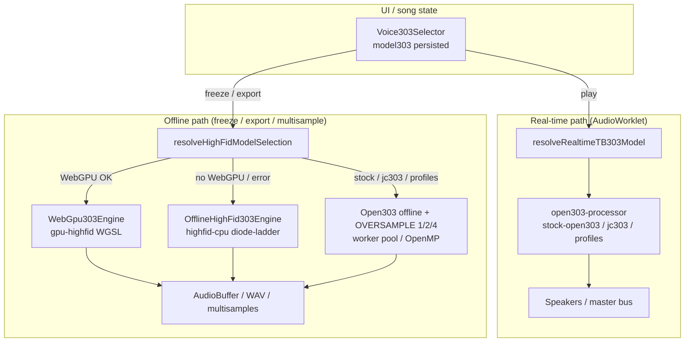

# High-Fidelity TB-303 Path — Architecture & Usage

**Epic**: [#972](https://github.com/ford442/web_sequencer/issues/972) — Multi-core + WGSL High-Fidelity TB-303  
**Phase-6**: [#979](https://github.com/ford442/web_sequencer/issues/979) — Docs, changelog & rollout  

This is the **public architecture / usage guide** for Hyphon’s high-fidelity
303 option. Per-phase implementation notes live in the linked docs below;
start here for how the pieces fit together.

| Audience | Read |
|----------|------|
| Users / producers | [Enable a high-fid voice](#how-to-enable), [UI badges](#ui-badges--status), [FAQ](#faq) |
| Maintainers | [Architecture](#architecture), [Fallback chain](#fallback-chain), [Performance & memory](#performance--memory) |
| Contributors | Per-phase docs in [Related](#related-docs) + [Roadmap](#roadmap--next-steps) |

---

## What “high-fidelity” means here

Hyphon keeps the **real-time AudioWorklet** path (Open303 / JC-303) latency-safe
and unchanged. Higher authenticity models run **offline only** — freeze,
WAV/XM export, and multisample generation — with a clear UI story and automatic
fallback when WebGPU or heavy CPU is unavailable.

| Model id | Label (UI) | Where it runs | Family badge |
|----------|------------|---------------|--------------|
| `highfid-cpu` | High-Fidelity CPU (offline) | Worker / OpenMP diode-ladder | **HIFID** + amber **Offline** |
| `gpu-highfid` | GPU High-Fidelity (offline) | WebGPU WGSL compute (else CPU) | **HIFID** + **Offline** (+ **No GPU** if needed) |
| `live-highfid` | Live High-Fidelity | AudioWorklet diode-ladder @ 1× (Phase-L1) | **HIFID** + amber **Live** |

Realtime playback of a part that has a high-fid model selected still uses
**Stock Open303** via `resolveRealtimeTB303Model`. The requested id is
persisted in the song so freeze/export pick up the authenticity tier later.

---

## Architecture

### Real-time vs offline



### Stack by phase


| Phase | Deliverable | Doc |
|-------|-------------|-----|
| 0 | Soft-oracle baselines + gap thresholds | [303-authenticity-gaps.md](./303-authenticity-gaps.md) |
| 1 | Offline oversampling + worker pool | [OFFLINE_303_OVERSAMPLE.md](./OFFLINE_303_OVERSAMPLE.md) |
| 2 | Diode-ladder CPU oracle | [HIGHFID_CPU_303.md](./HIGHFID_CPU_303.md) |
| 3 | WGSL GPU authenticity tier | [GPU_HIGHFID_303.md](./GPU_HIGHFID_303.md) |
| 4 | Registry, selector badges, degradation | [303-voices.md](./303-voices.md) |
| 5 | Spectrogram gates, benchmarks, Playwright | [303-A-B-checklist.md](./303-A-B-checklist.md) |
| 6 | This guide + changelog | *(you are here)* |

---

## How to enable

### In the app

1. Initialize audio (**INITIALIZE SYSTEM**).
2. Open **SYNTH A**, **SYNTH B**, or **BASS 2** and select a `303-*` waveform.
3. In **303 Voice**, pick **High-Fidelity CPU (offline)** or **GPU High-Fidelity (offline)**.
4. Live play uses Stock Open303; status line shows  
   `Offline engine: highfid-cpu|gpu-highfid · live uses Stock Open303`.
5. Use freeze / export / multisample to hear the authenticity tier.

### From code

```ts
import { render303Offline } from '@/audio/OfflineRenderer';
import { makeCanonical64StepPattern } from '@/audio/OfflineRenderer';

// CPU diode-ladder @ 4× oversample (sync path for tests / no Worker)
await render303Offline('highfid-cpu', makeCanonical64StepPattern(), {
  oversample: 4,
  sync: true,
});

// GPU path — falls back to highfid-cpu when WebGPU is missing
await render303Offline('gpu-highfid', makeCanonical64StepPattern(), {
  oversample: 4,
});
```

Registry helpers (`src/engines/TB303Models.ts`):

| Helper | Role |
|--------|------|
| `normalizeTB303Model` | Persist requested id (incl. offline high-fid) |
| `resolveRealtimeTB303Model` | Map high-fid → `stock-open303` for AudioWorklet |
| `resolveHighFidModelSelection` | Pick offline engine + optional fallback reason |
| `getAvailableTB303Models({ includeOfflineOnly: true })` | Selector list |

---

## Fallback chain

```
gpu-highfid  →  highfid-cpu  →  stock Open303 / JC-303  →  JS DSP
```

| Condition | Behaviour | User-visible |
|-----------|-----------|--------------|
| WebGPU present, shader OK | Offline render on WGSL | Status: `Offline engine: gpu-highfid` |
| No WebGPU / compile / alloc / readback fail | Offline render on diode-ladder CPU | **No GPU** badge + amber status / degradation banner |
| High-fid selected for live play | AudioWorklet stays on Stock Open303 | Status mentions live uses Stock Open303 |
| Worker has no WebGPU | Worker always uses highfid-cpu for `gpu-highfid` jobs | Telemetry `gpuFallbackReason` / `gpuUsedGpu: false` |

Never crashes the AudioWorklet when WebGPU is absent (Firefox / Safari / headless CI).

---

## UI badges & status

Matches `Voice303Selector` and [303-A-B-checklist.md](./303-A-B-checklist.md):

| Indicator | Meaning |
|-----------|---------|
| **OPEN303** / **JC303** | Realtime engine family |
| **HIFID** | High-fidelity family selected (live or offline) |
| Amber **Offline** pill on a voice row | Voice is freeze/export/multisample only |
| Amber **Live** pill on a voice row | Realtime diode ladder (`live-highfid`, Phase-L1) |
| **No GPU** | WebGPU unavailable; GPU High-Fidelity falls back to CPU |
| Status line | Effective offline engine + live Stock Open303 reminder |
| Engine HUD (**Ctrl+Shift+E**) → Offline 303 | Oversample, thread count, latency, GPU telemetry |

In-app Help (`?`) → **High-fidelity 303 (offline)** and the updated **303 Voice selector** topic.

---

## Performance & memory

Guidelines (order-of-magnitude on a modern laptop). Soft budgets — not hard CI
fails unless noted in Phase-5 jobs.

| Workload | Soft budget | Notes |
|----------|-------------|-------|
| Stock Open303 offline, 64-step @ 4× | ~200–400 ms | [OFFLINE_303_OVERSAMPLE.md](./OFFLINE_303_OVERSAMPLE.md) |
| `highfid-cpu` canonical 4-step @ 4× | &lt; 500 ms | Benchmark script |
| `highfid-cpu` 64-step stress @ 4× | &lt; 3 s | Worker pool OK |
| `gpu-highfid` multi-second pattern | ~150–300 ms GPU wall (device-dependent) | CPU fallback slower in CI |
| Concurrent offline renders | 8× highfid-cpu without OOM | `Offline303Stress.test.ts` |

**Memory tips**

- Prefer worker pool over main-thread sync for long exports.
- GPU path allocates a readback buffer; oversized jobs fall back to CPU
  (`MAX_BUFFER_SIZE` in `WebGpu303Engine`).
- Offline metrics **do not** feed `masterBudgetPercent` — see
  [PERFORMANCE_BUDGET.md](../PERFORMANCE_BUDGET.md).

```bash
pnpm exec vite-node scripts/benchmark_offline303.mjs
bash scripts/benchmark_highfid303.sh
CI=true pnpm exec vitest run src/__tests__/Offline303Stress.test.ts --pool forks
```

---

## FAQ

### Why offline only?

The diode-ladder and WGSL paths are recursive / heavy. Running them on the
AudioWorklet would risk underruns and violate epic principle #1: **real-time
latency must not regress**. Offline jobs run on workers / OpenMP / GPU with
telemetry outside the master audio-thread budget.

Since Phase-L1 there *is* a realtime diode-ladder voice — `live-highfid`, at
oversample 1 and behind a CPU/glitch gate that hands it back to Stock Open303
rather than underrunning
([303-realtime-highfid.md](./303-realtime-highfid.md)). `highfid-cpu` and
`gpu-highfid` stay offline-only: the 4× oversampled and WGSL paths still cannot
meet a quantum deadline.

### Why WebGPU?

WebGPU compute is the browser path for a full nonlinear voice without blocking
audio. Chrome/Edge typically expose it; Firefox/Safari often do not yet — hence
the automatic **highfid-cpu** fallback and **No GPU** badge.

### Will my song sound different when I reopen it?

The **persisted** `model303` stays `gpu-highfid` or `highfid-cpu`. Live play
still uses Stock Open303 until you freeze/export. On a machine without WebGPU,
offline render of `gpu-highfid` silently uses CPU (same topology) so exports
remain usable.

### How does this relate to JC303 / character voices?

JC303 and open303 coefficient profiles (`rebirth-*`, `mb33-mkii`, …) remain
realtime-capable. High-fid is a separate authenticity **tier** for offline
renders, not a replacement for those voices. Catalog:
[303-voices.md](./303-voices.md).

### How do I A/B authenticity?

1. Automated: `TB303SpectrogramQuality.test.ts` + baseline WAVs in
   `303-baseline/`.
2. Manual: [303-A-B-checklist.md](./303-A-B-checklist.md).
3. Optional local render: `pnpm exec vite-node scripts/render_gpu_highfid_wav.mjs`.

### Can I edit diode-ladder coefficients in the UI?

Not yet — tracked as L3 in
[303-realtime-highfid.md](./303-realtime-highfid.md#tracking-checklist-l2l5).

---

## Demo renders (optional)

Committed Phase-0/2 baselines already cover the canonical 4-step pattern:

| File | Engine |
|------|--------|
| `docs/audio-engine/303-baseline/stock-open303_canonical.wav` | Stock |
| `docs/audio-engine/303-baseline/jc303_canonical.wav` | Soft oracle |
| `docs/audio-engine/303-baseline/highfid-cpu_canonical.wav` | High-fid CPU |

Generate a 1 s GPU/CPU-equivalent clip locally (not committed — regenerable):

```bash
pnpm exec vite-node scripts/render_gpu_highfid_wav.mjs
# → /tmp/gpu-highfid_1s.wav
```

Regenerate spectrograms / metrics after engine changes:

```bash
bash scripts/generate_303_baselines.sh
```

---

## Roadmap / next steps

Stable for freeze/export. The follow-ups below now live in
[303-realtime-highfid.md](./303-realtime-highfid.md), which also documents the
**Phase-L1 live diode-ladder voice** (`live-highfid`) that shipped after this
epic closed:

1. **Live CPU high-fid** (L1) — **shipped**: `live-highfid` runs the diode
   ladder in the AudioWorklet at oversample 1 behind a CPU/glitch gate.
2. **Live A/B** (L2) — two synced instances (stock vs high-fid) for audition.
3. **User-editable coefficients** (L3) for the diode-ladder oracle.
4. **Hardware TB-303 reference WAV** (L4) to replace the jc303 soft oracle in
   absolute gates ([303-authenticity-gaps.md](./303-authenticity-gaps.md)).
5. **Real-time GPU audio** (L5) when browsers offer low-latency
   WebGPU ↔ AudioWorklet bridging without underruns.

---

## Epic completeness review (#972)

| Phase | Issue | PR (merged) | Status |
|-------|-------|-------------|--------|
| 0 Gap audit & baselines | #973 | #1001 / #1002 | Done |
| 1 Oversample + workers | #974 | #1004 | Done |
| 2 highfid-cpu | #975 | #1005 | Done |
| 3 gpu-highfid WGSL | #976 | #1006 | Done |
| 4 Registry / UI / degradation | #977 | #1010 | Done |
| 5 Spectrogram / E2E / stress | #978 | #1011 | Code merged — close issue after verify |
| 6 Docs / changelog / rollout | #979 | *(this change)* | Docs + help + CHANGELOG |

**Close criteria for the epic:** merge Phase-6 docs; confirm UI badges match this guide;
close #978 / #979 / #972. Remaining roadmap items (live GPU audio, live A/B,
editable coefficients, hardware reference WAV) are **follow-ups**, not blockers.

---

## Related docs

| Doc | Role |
|-----|------|
| [303-realtime-highfid.md](./303-realtime-highfid.md) | Live diode-ladder voice (Phase-L1) + L2–L5 tracking |
| [303-voices.md](./303-voices.md) | Full voice catalog + registry contract |
| [303-authenticity-gaps.md](./303-authenticity-gaps.md) | Gap audit G1–G7 + thresholds |
| [OFFLINE_303_OVERSAMPLE.md](./OFFLINE_303_OVERSAMPLE.md) | Oversample + worker pool |
| [HIGHFID_CPU_303.md](./HIGHFID_CPU_303.md) | CPU diode-ladder |
| [GPU_HIGHFID_303.md](./GPU_HIGHFID_303.md) | WGSL engine API |
| [303-A-B-checklist.md](./303-A-B-checklist.md) | Manual + automated release checklist |
| [OPENMP_IMPLEMENTATION.md](./OPENMP_IMPLEMENTATION.md) | OpenMP DSP helpers |
| [PERFORMANCE_BUDGET.md](../PERFORMANCE_BUDGET.md) | Audio-thread budget vs offline metrics |
| [CHANGELOG.md](../../CHANGELOG.md) | Release notes |
