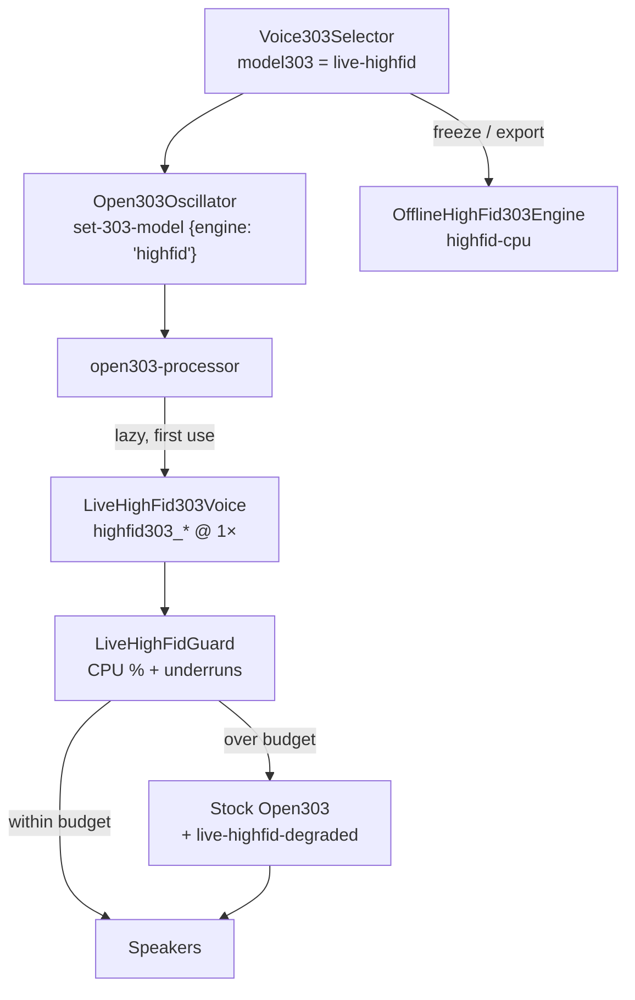

# Real-time High-Fidelity TB-303 — Phase L1

**Follow-up to epic** [#972](https://github.com/ford442/web_sequencer/issues/972) (offline high-fid 303).
Moves the "later Hyphon" follow-ups out of
[303-gpu-highfid.md](./303-gpu-highfid.md#roadmap--next-steps) and records what
actually shipped.

Before this change every real-time voice went through Stock Open303 / JC303:
`resolveRealtimeTB303Model` mapped the high-fid ids to `stock-open303`, so the
diode ladder was only audible **after** a freeze. Producers could not A/B
authenticity while the sequencer ran.

Phase **L1** ships a selectable live diode-ladder voice. Phases L2–L5 are
tracked, not shipped — see [Tracking checklist](#tracking-checklist-l2l5).

---

## What shipped (L1)

| Piece | Where |
|-------|-------|
| Live voice catalog entry `live-highfid` | `src/engines/TB303Models.ts` |
| Realtime WASM glue + CPU/glitch gate | `src/audio-worklets/liveHighFid303.ts` |
| Worklet routing (third engine family) | `src/audio-worklets/open303-processor.ts` |
| Main-thread selection + fallback handling | `src/engines/Open303Oscillator.ts` |
| HUD "Live 303 path" section | `src/components/EngineHUD.tsx` |
| Selector **Live** pill + status line | `src/components/Voice303Selector.tsx` |

### The voice

| Model id | Label | Family | Runs |
|----------|-------|--------|------|
| `live-highfid` | Live High-Fidelity | `highfid` | AudioWorklet, oversample 1× (2× opt-in) |
| `highfid-cpu` | High-Fidelity CPU (offline) | `highfid` | Worker / OpenMP — **offline only**, unchanged |
| `gpu-highfid` | GPU High-Fidelity (offline) | `highfid` | WGSL compute — **offline only**, unchanged |

`live-highfid` is a *new* id, deliberately not a change of meaning for the two
offline ids: a song saved with `highfid-cpu` still plays stock live and freezes
high-fid, exactly as before.

### Why CPU and not GPU

The issue's L5 (GPU live) stays research. Bridging a WebGPU compute pass into
`process()` means either blocking on `queue.onSubmittedWorkDone()` — an instant
underrun — or a SharedArrayBuffer ring buffer whose latency budget no browser
currently makes dependable. L1 runs the same C topology
(`emscripten/highfid303_wrapper.cpp`) that the offline reference uses, at
oversample 1, inside the worklet that is already there. No new WASM module, no
new thread, no ring buffer.

The `highfid303_*` exports are already built into `hyphon_native.wasm` and are
listed as **optional** in `emscripten/wasm_export_manifest.json`. A build that
pruned them reports `live-highfid-unavailable` and the voice degrades to stock —
it never hard-fails.

---

## Signal path



Three properties this shape buys:

1. **Stock voices are untouched.** The WASM instance is created lazily on first
   selection, and the `process()` branch is only reached when a track actually
   selected the live voice — epic #972 principle #1 (real-time latency for stock
   voices must not regress) holds by construction.
2. **Freeze matches play.** `isHighFidCpuModel()` accepts `live-highfid`, so a
   freeze / export / multisample of a live high-fid track renders through the
   same diode ladder rather than silently reverting to stock. The Phase-5
   spectrogram gates still drive the `highfid-cpu` id and are unaffected.
3. **It yields rather than glitches.** The CPU gate hands the voice back to
   stock before the audio thread starts dropping blocks.

---

## The CPU / glitch gate

`LiveHighFidGuard` (`src/audio-worklets/liveHighFid303.ts`) measures the
high-fid render alone — not the whole `process()` — against the quantum budget
and steps down on either signal:

| Signal | Default | Rationale |
|--------|---------|-----------|
| Sustained CPU | EMA ≥ **60 %** of the quantum for **24** consecutive blocks (~64 ms @ 48 kHz) | One scheduling hiccup must not flip a healthy voice |
| Hard underruns | **8** blocks over 100 % inside a rolling **200**-block window | Already audible; stop immediately |
| Warm-up | first **32** blocks ignored | JIT / cache warm-up is not a verdict |

The gate trips **once per session**. Re-selecting the voice after a step-down
does not re-arm it — that would just glitch again; a reload does.

On a trip the worklet clears held notes, destroys the instance, switches to
`stock-open303`, and posts `live-highfid-degraded`. `Open303Oscillator` mirrors
that on the main thread:

- `engineTelemetry.recordLiveHighFid({ active: false, reason, cpuPercent })`
- `engineDegradationStore.reportLiveHighFidFallback(...)` → toast + HUD banner
- `reportTB303ModelFallback(...)` → console + telemetry breadcrumb

This is the audio-thread-local sibling of the master auto-degrade ladder in
[PERFORMANCE_BUDGET.md](../PERFORMANCE_BUDGET.md): the ladder sheds global
features when the *sum* of worklets overruns, while this gate sheds one voice
that is individually too expensive.

---

## UI & telemetry

| Indicator | Meaning |
|-----------|---------|
| Amber **Live** pill on the voice row | Realtime diode ladder (as opposed to the **Offline** pill) |
| **HIFID** family badge | `High-fidelity live engine family active` when `live-highfid` is selected |
| Selector status line | `Live diode ladder · freeze uses highfid-cpu · falls back to Stock Open303 over CPU budget` |
| Engine HUD → **Live 303 path** | `LIVE HIFID` / `stock (degraded)`, rolling CPU %, oversample, fallback reason |

Runtime telemetry fields (engine report `runtime` block):

| Field | Meaning |
|-------|---------|
| `liveHighFidRequested` | Voice the track asked for |
| `liveHighFidActive` | `true` = diode ladder audible, `false` = stepped down, `null` = never used |
| `liveHighFidFallbackReason` | Why it stepped down |
| `liveHighFidCpuPercent` | Rolling share of the quantum at the time of the step-down |
| `liveHighFidOversample` | 1 or 2 |

E2E hook: `window.__HYPHON_E2E__.getLiveHighFidState()` (`?e2e=1`).

---

## Usage

### In the app

1. Initialize audio, open **SYNTH A / SYNTH B / BASS 2**, pick a `303-*` waveform.
2. In **303 Voice**, choose **Live High-Fidelity** (amber **Live** pill).
3. Play. The HUD (**Ctrl+Shift+E**) → *Live 303 path* shows `LIVE HIFID` and the
   CPU share; if the machine cannot keep up it flips to `stock (degraded)` with
   the reason.

### From code

```ts
oscillator.setModel303('live-highfid');
oscillator.setLiveHighFidOversample(2); // opt-in, roughly doubles the cost
```

`setLiveHighFidOversample` clamps to 1 or 2 — 4× is an offline-only factor.

---

## Testing

| Tier | Coverage |
|------|----------|
| Unit — `src/__tests__/LiveHighFid303.test.ts` | Registry/selection, guard behaviour (warm-up, sustained CPU, underruns, trip-once, reset), WASM wrapper incl. missing/failed exports, main-thread fallback plumbing |
| Unit — `src/__tests__/TB303Models.test.ts` | Worklet message shape (`engine: 'highfid'`, oversample) |
| E2E — `tests/highfid-engine-matrix.spec.ts` | Live voice selectable, **Live** not **Offline** pill, live family badge, active-or-explained-degradation |

Offline gates (`TB303SpectrogramQuality`, `HighFid303Offline`,
`TB303AuthenticityBaselines`) are untouched: they drive `highfid-cpu` /
`gpu-highfid` and the offline DSP did not change. They need built native
artifacts (`pnpm run build:native`) and so only run where the emscripten
toolchain is available.

---

## Tracking checklist (L2–L5)

Deferred, with the reason each was not folded into L1.

- [ ] **L2 — Live A/B.** Two voices on the same MIDI with independent buses and
      a flip/blend control. Needs a second `Open303Oscillator` per part plus
      mixer routing and a session-launcher rule for freezing only the high-fid
      side. Nothing in L1 blocks it: a second oscillator can already be set to
      `live-highfid` while the first stays stock.
- [ ] **L3 — Editable diode-ladder coefficients.** Transistor mismatch, decay
      curve, accent coupling, filter tracking, persisted on a `model303` extra
      blob with export round-trip. Requires new `highfid303_set_param` ids in
      `emscripten/highfid303_wrapper.cpp` (a WASM rebuild) and a coefficient
      table — ideally SharedArrayBuffer-backed so the UI can morph without
      reallocating the voice. Spectrogram tests must keep using a **canonical
      coefficient preset**, never live UI values.
- [ ] **L4 — Hardware oracle.** Replace the jc303 **soft** oracle with a
      documented hardware take of the canonical 4-step pattern. Blocked on a
      licensed or self-recorded TB-303 WAV: a ripped commercial sample pack
      cannot be committed. Capture protocol is already in
      [303-baseline/](./303-baseline/). Until then **CI still gates against
      jc303**, and the gap is that absolute authenticity numbers are relative to
      a software oracle, not hardware.
- [ ] **L5 — GPU live (research).** Same WGSL as offline `gpu-highfid`,
      different scheduling: a SAB ring buffer fed by a compute pass, never
      blocking `process()` on `queue.onSubmittedWorkDone()`. Gated on L1 being
      stable in the field and on browsers bridging WebGPU ↔ AudioWorklet without
      underruns. No WebGL fallback for audio
      ([webgpu-session.md](./webgpu-session.md)).

---

## Related docs

| Doc | Role |
|-----|------|
| [303-gpu-highfid.md](./303-gpu-highfid.md) | Offline high-fid architecture (epic #972) |
| [303-voices.md](./303-voices.md) | Voice catalog + registry contract |
| [HIGHFID_CPU_303.md](./HIGHFID_CPU_303.md) | Diode-ladder topology |
| [PERFORMANCE_BUDGET.md](../PERFORMANCE_BUDGET.md) | Audio-thread budget + auto-degrade ladder |
| [303-authenticity-gaps.md](./303-authenticity-gaps.md) | Gap audit + oracle thresholds |
