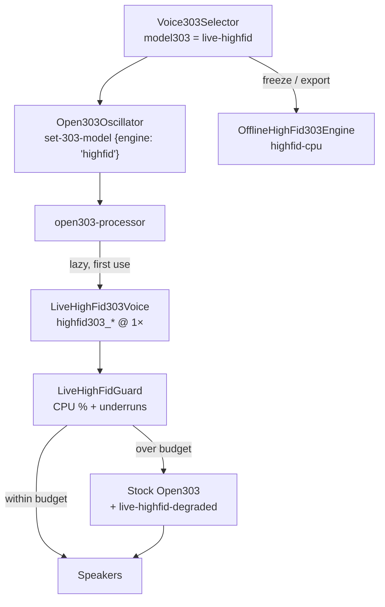
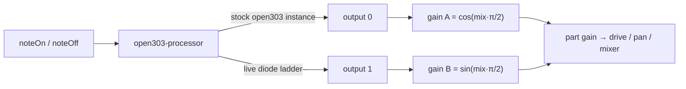

# Real-time High-Fidelity TB-303 — Phases L1–L3

**Follow-up to epic** [#972](https://github.com/ford442/web_sequencer/issues/972) (offline high-fid 303).
Moves the "later Hyphon" follow-ups out of
[303-gpu-highfid.md](./303-gpu-highfid.md#roadmap--next-steps) and records what
actually shipped.

Before this change every real-time voice went through Stock Open303 / JC303:
`resolveRealtimeTB303Model` mapped the high-fid ids to `stock-open303`, so the
diode ladder was only audible **after** a freeze. Producers could not A/B
authenticity while the sequencer ran.

Phase **L1** ships a selectable live diode-ladder voice. **L2** adds live A/B
against stock Open303 and **L3** adds editable diode-ladder coefficients — see
[Live A/B (L2)](#live-ab-l2) and [Editable coefficients (L3)](#editable-diode-ladder-coefficients-l3).
L4–L5 are tracked, not shipped — see [Tracking checklist](#tracking-checklist-l2l5).

---

## What shipped (L1)

| Piece | Where |
|-------|-------|
| Live voice catalog entry `live-highfid` | `src/engines/TB303Models.ts` |
| Realtime WASM glue + CPU/glitch gate | `src/audio-worklets/liveHighFid303.ts` |
| Worklet routing (third engine family) | `src/audio-worklets/open303-processor.ts` |
| Main-thread selection + fallback handling | `src/engines/Open303Oscillator.ts` |
| HUD "Live 303 path" section | `src/components/EngineHUD.tsx` |
| Selector **Live** pill + status line | `src/components/Voice303Selector.tsx` |

### The voice

| Model id | Label | Family | Runs |
|----------|-------|--------|------|
| `live-highfid` | Live High-Fidelity | `highfid` | AudioWorklet, oversample 1× (2× opt-in) |
| `highfid-cpu` | High-Fidelity CPU (offline) | `highfid` | Worker / OpenMP — **offline only**, unchanged |
| `gpu-highfid` | GPU High-Fidelity (offline) | `highfid` | WGSL compute — **offline only**, unchanged |

`live-highfid` is a *new* id, deliberately not a change of meaning for the two
offline ids: a song saved with `highfid-cpu` still plays stock live and freezes
high-fid, exactly as before.

### Why CPU and not GPU

The issue's L5 (GPU live) stays research. Bridging a WebGPU compute pass into
`process()` means either blocking on `queue.onSubmittedWorkDone()` — an instant
underrun — or a SharedArrayBuffer ring buffer whose latency budget no browser
currently makes dependable. L1 runs the same C topology
(`emscripten/highfid303_wrapper.cpp`) that the offline reference uses, at
oversample 1, inside the worklet that is already there. No new WASM module, no
new thread, no ring buffer.

The `highfid303_*` exports are already built into `hyphon_native.wasm` and are
listed as **optional** in `emscripten/wasm_export_manifest.json`. A build that
pruned them reports `live-highfid-unavailable` and the voice degrades to stock —
it never hard-fails.

---

## Signal path



Three properties this shape buys:

1. **Stock voices are untouched.** The WASM instance is created lazily on first
   selection, and the `process()` branch is only reached when a track actually
   selected the live voice — epic #972 principle #1 (real-time latency for stock
   voices must not regress) holds by construction.
2. **Freeze matches play.** `isHighFidCpuModel()` accepts `live-highfid`, so a
   freeze / export / multisample of a live high-fid track renders through the
   same diode ladder rather than silently reverting to stock. The Phase-5
   spectrogram gates still drive the `highfid-cpu` id and are unaffected.
3. **It yields rather than glitches.** The CPU gate hands the voice back to
   stock before the audio thread starts dropping blocks.

---

## The CPU / glitch gate

`LiveHighFidGuard` (`src/audio-worklets/liveHighFid303.ts`) measures the
high-fid render alone — not the whole `process()` — against the quantum budget
and steps down on either signal:

| Signal | Default | Rationale |
|--------|---------|-----------|
| Sustained CPU | EMA ≥ **60 %** of the quantum for **24** consecutive blocks (~64 ms @ 48 kHz) | One scheduling hiccup must not flip a healthy voice |
| Hard underruns | **8** blocks over 100 % inside a rolling **200**-block window | Already audible; stop immediately |
| Warm-up | first **32** blocks ignored | JIT / cache warm-up is not a verdict |

The gate trips **once per session**. Re-selecting the voice after a step-down
does not re-arm it — that would just glitch again; a reload does.

On a trip the worklet clears held notes, destroys the instance, switches to
`stock-open303`, and posts `live-highfid-degraded`. `Open303Oscillator` mirrors
that on the main thread:

- `engineTelemetry.recordLiveHighFid({ active: false, reason, cpuPercent })`
- `engineDegradationStore.reportLiveHighFidFallback(...)` → toast + HUD banner
- `reportTB303ModelFallback(...)` → console + telemetry breadcrumb

This is the audio-thread-local sibling of the master auto-degrade ladder in
[PERFORMANCE_BUDGET.md](../PERFORMANCE_BUDGET.md): the ladder sheds global
features when the *sum* of worklets overruns, while this gate sheds one voice
that is individually too expensive.

---

## Live A/B (L2)

A part on `live-highfid` can arm **A/B vs stock**. You then hear Stock Open303 (A)
and the diode ladder (B) from the **same note stream** on two buses, and can flip
or blend them while the sequencer runs.

| Piece | Where |
|-------|-------|
| Crossfade gains + coefficient link | `src/engines/LiveHighFidAbPair.ts` |
| Oscillator API (`setLiveAb`, `setLiveAbMix`) | `src/engines/Open303Oscillator.ts` |
| Worklet: stock shadow notes, two-output render, per-side CPU | `src/audio-worklets/open303-processor.ts`, `open303/engineSelection.ts` |
| Manager + automation (`setAbMix`, `abMix` lane) | `src/engines/Open303Manager.ts`, `src/audio/automation/AutomationScheduler.ts` |
| Persistence (`model303Extra.ab`) + freeze rule | `src/engines/tb303VoiceExtra.ts`, `src/audio/OfflineRenderer.ts` |
| UI: A/B toggle, A/B flip, blend slider | `src/components/LiveHighFidControls.tsx` (inside `Voice303Selector`) |



**Why not a second `Open303Oscillator`?** The processor that runs the live
diode ladder already owns a custom open303 instance: L1 keeps it in sync with
every param so a CPU-gate step-down lands on a ready stock voice. L2 renders
that instance too, so A/B gets one MIDI stream by construction. It adds no
AudioWorkletNode, no WASM instance and no heap. The node now declares
`numberOfOutputs: 2`; output 1 stays unconnected and unwritten unless A/B is
engaged.

**Cost control.** The request (`armed`, `mix`) is stored per part, but it only
*engages* while the part plays `live-highfid`. The crossfade gains are created
on the first engage, and the worklet renders the stock side only while
engaged. A stock-only session, or a live-highfid part without A/B, runs exactly
the L1 graph and `process()` branch. Arming starts at blend 1, fully on B, so
arming never changes what you hear.

**Blend.** Equal-power: `A = cos(mix·π/2)`, `B = sin(mix·π/2)`, snapped to
exactly 1/0 at the flip endpoints. Blend changes are `setValueAtTime` calls on
the audio clock, so automation (`abMix` on `synthA` / `synthB` / `bass2`) lands
on its step.

**CPU gate.** Only the high-fid render time feeds `LiveHighFidGuard`, so the
gate can only ever trip side B. On a trip while A/B is engaged:

1. the worklet silences and destroys **only** the diode ladder. It leaves the
   stock instance's notes and profile alone, and mirrors stock onto output 1
   until the main thread reacts, so a blend parked on B never drops to silence;
2. `Open303Oscillator` collapses the blend to A: output 0 goes straight back to
   the part gain and the worklet is told `set-live-ab {armed: false}`;
3. the A/B request stays stored. Like L1, the gate does not re-arm itself in
   the same session.

**HUD.** *Live 303 path* adds `A/B blend`, `A stock CPU` and `B hifi CPU` rows
while A/B is engaged (`live-ab-cpu` posts about every 250 ms).

### Freeze / capture of an A/B part

`resolveTB303FreezeJob` / `render303FreezeOffline` freeze **one side**:
high-fid at `mix ≥ 0.5`, stock below. Rendering a blend needs both sides in one
offline graph. That is the compiler's job (#1235), so a blend is never frozen
until it lands. The selector states which side a freeze would record.

---

## Editable diode-ladder coefficients (L3)

Four `highfid303_set_param` ids after the Open303Param mirror (0–13), each
0–1:

| Id | Coefficient | Effect | Canonical |
|----|-------------|--------|-----------|
| 14 | `transistorMismatch` | Pole spread: stage *i* uses `b0·(1 + m·s_i)`, `s = [+.08, −.05, +.06, −.09]` | 0 |
| 15 | `decayCurve` | Filter-envelope shape: `env^(1 + 3c)` (0 = plain exponential) | 0 |
| 16 | `accentCoupling` | Accent envelope → cutoff (was the hard-coded `0.45`) | 0.45 |
| 17 | `filterTracking` | Keyboard follow: `cutoff · (f / 261.63 Hz)^t` | 0 |

They are implemented identically in `emscripten/highfid303_wrapper.cpp` (the live
voice) and `src/audio/offline/OfflineHighFid303Engine.ts` (freeze / export worker).
Shared constants live in `src/audio-worklets/liveHighFidCoefficients.ts`.

**Canonical preset = pre-L3 output, bit for bit.** With the canonical values
the code takes the unshaped / untracked branches, multiplies each stage by
exactly `1.0`, and uses `0.45` where the constant was. A native render of the
wrapper and the TS port at 1×/2×/4× both produce byte-identical output against
the previous implementation. The wrapper stays on `compile_cpp`, **not**
`compile_cpp_fast`: `-ffast-math` could reassociate that arithmetic.

**Quality gates use the canonical preset, never UI values.**
`scripts/generate_303_baselines.sh`, the spectrogram / RMS tests and the native
harnesses never set ids 14–17, so they measure the canonical voice. A new test
asserts that an explicit canonical preset renders identically to none.

**Morphing without reallocating.** When the page is `crossOriginIsolated`, each
live-highfid part that stored coefficients gets a 20-byte `SharedArrayBuffer`:
an Int32 generation counter plus four Float32 values. The UI writes it; the
worklet does one `Atomics.load` per high-fid block and pushes `set_param` only
when the generation moved. Without isolation it falls back to
`set-highfid-coeffs` messages. The table is deliberately **not** carved out of
the `hyphon_native` heap: that heap is the single imported memory budgeted in
`wasm_memory_budget.json`, and a knob table has no business growing it.
A part that never stored coefficients gets no table and no message; the
voice starts canonical.

**Persistence.** `SynthParams.model303Extra` / `Bass2Params.model303Extra`
(`TB303VoiceExtra`):

```ts
model303Extra?: {
  ab?: { armed: boolean; mix: number };           // L2
  highFidCoefficients?: HighFidCoefficients;      // L3 — absent = canonical
}
```

The blob is optional: older songs load unchanged, and older builds ignore it.
"Canonical" in the UI removes `highFidCoefficients` again, so a song only
carries coefficients once someone moved one.

**Freeze.** A `live-highfid` (or `highfid-cpu`) part freezes through
`highfid-cpu` with the **song's** coefficients if it stored any, otherwise the
**canonical** preset (`TB303FreezeJob.coefficientSource` says which).
`gpu-highfid` keeps its canonical WGSL; coefficients are CPU-only.

**WASM rebuild.** The new ids need `pnpm run build:emcc`. A `hyphon_native.wasm`
built before L3 ignores unknown ids (the `default:` case), so the live voice
stays canonical until the rebuild. The TS offline path does not depend on it.
No export was added.

---

## UI & telemetry

| Indicator | Meaning |
|-----------|---------|
| Amber **Live** pill on the voice row | Realtime diode ladder (as opposed to the **Offline** pill) |
| **HIFID** family badge | `High-fidelity live engine family active` when `live-highfid` is selected |
| Selector status line | `Live diode ladder · freeze uses highfid-cpu · falls back to Stock Open303 over CPU budget` |
| Engine HUD → **Live 303 path** | `LIVE HIFID` / `stock (degraded)`, rolling CPU %, oversample, fallback reason |

Runtime telemetry fields (engine report `runtime` block):

| Field | Meaning |
|-------|---------|
| `liveHighFidRequested` | Voice the track asked for |
| `liveHighFidActive` | `true` = diode ladder audible, `false` = stepped down, `null` = never used |
| `liveHighFidFallbackReason` | Why it stepped down |
| `liveHighFidCpuPercent` | Rolling share of the quantum at the time of the step-down |
| `liveHighFidOversample` | 1 or 2 |
| `liveAbArmed` / `liveAbEngaged` | A/B requested / both buses wired (L2) |
| `liveAbMix` | Current blend, 0 = stock, 1 = high-fid |
| `liveAbStockCpuPercent` / `liveAbHighFidCpuPercent` | Rolling per-side CPU share while A/B is engaged |

E2E hook: `window.__HYPHON_E2E__.getLiveHighFidState()` (`?e2e=1`).

---

## Usage

### In the app

1. Initialize audio, open **SYNTH A / SYNTH B / BASS 2**, pick a `303-*` waveform.
2. In **303 Voice**, choose **Live High-Fidelity** (amber **Live** pill).
3. Play. The HUD (**Ctrl+Shift+E**) → *Live 303 path* shows `LIVE HIFID` and the
   CPU share; if the machine cannot keep up it flips to `stock (degraded)` with
   the reason.

### From code

```ts
oscillator.setModel303('live-highfid');
oscillator.setLiveHighFidOversample(2); // opt-in, roughly doubles the cost

// L2 — A/B against stock, blend automatable on the audio clock
oscillator.setLiveAb({ armed: true, mix: 1 });
oscillator.setLiveAbMix(0.5, ctx.currentTime + 0.25);

// L3 — morph the diode ladder in place (undefined = canonical)
oscillator.setHighFidCoefficients({
  transistorMismatch: 0.3, decayCurve: 0.2, accentCoupling: 0.6, filterTracking: 0.5,
});

// Freeze exactly what the song describes (side + coefficients)
const { buffer, job } = await render303FreezeOffline(synthA, pattern);
```

`setLiveHighFidOversample` clamps to 1 or 2 — 4× is an offline-only factor.

---

## Testing

| Tier | Coverage |
|------|----------|
| Unit — `src/__tests__/LiveHighFid303.test.ts` | Registry/selection, guard behaviour (warm-up, sustained CPU, underruns, trip-once, reset), WASM wrapper incl. missing/failed exports, main-thread fallback plumbing |
| Unit — `src/__tests__/TB303Models.test.ts` | Worklet message shape (`engine: 'highfid'`, oversample) |
| E2E — `tests/highfid-engine-matrix.spec.ts` | Live voice selectable, **Live** not **Offline** pill, live family badge, active-or-explained-degradation |
| Unit — `src/__tests__/LiveHighFidAbCoefficients.test.ts` | L2: equal-power blend, lazy engage, scheduled blend, gate trips only B (stock notes/profile untouched), per-side CPU, collapse on step-down. L3: param ids, canonical preset, SAB table, coefficient push/poll, song round-trip, freeze job (canonical vs stored, A/B side), canonical freeze bit-identical to plain `highfid-cpu` |
| Unit — `Voice303Selector.test.tsx`, `AutomationScheduler.test.ts` | A/B toggle / flip / blend UI, coefficient sliders + reset, `abMix` lane → `setAbMix` |

Offline gates (`TB303SpectrogramQuality`, `HighFid303Offline`,
`TB303AuthenticityBaselines`) are untouched: they drive `highfid-cpu` /
`gpu-highfid` and the offline DSP did not change. They need built native
artifacts (`pnpm run build:native`) and so only run where the emscripten
toolchain is available.

---

## Tracking checklist (L2–L5)

Deferred, with the reason each was not folded into L1.

- [x] **L2 — Live A/B.** Shipped — see [Live A/B (L2)](#live-ab-l2). Built on
      the processor's existing stock instance rather than a second
      `Open303Oscillator`, so the pair shares one note stream and one heap.
      Freezing a *blend* waits on #1235; until then a freeze records one side.
- [x] **L3 — Editable diode-ladder coefficients.** Shipped — see
      [Editable coefficients (L3)](#editable-diode-ladder-coefficients-l3).
      The live voice picks the ids up after the next `pnpm run build:emcc`.
- [ ] **L4 — Hardware oracle.** Replace the jc303 **soft** oracle with a
      documented hardware take of the canonical 4-step pattern. Blocked on a
      licensed or self-recorded TB-303 WAV: a ripped commercial sample pack
      cannot be committed. Capture protocol is already in
      [303-baseline/](./303-baseline/). Until then **CI still gates against
      jc303**, and the gap is that absolute authenticity numbers are relative to
      a software oracle, not hardware.
- [ ] **L5 — GPU live (research).** Same WGSL as offline `gpu-highfid`,
      different scheduling: a SAB ring buffer fed by a compute pass, never
      blocking `process()` on `queue.onSubmittedWorkDone()`. Gated on L1 being
      stable in the field and on browsers bridging WebGPU ↔ AudioWorklet without
      underruns. No WebGL fallback for audio
      ([webgpu-session.md](./webgpu-session.md)).

---

## Related docs

| Doc | Role |
|-----|------|
| [303-gpu-highfid.md](./303-gpu-highfid.md) | Offline high-fid architecture (epic #972) |
| [303-voices.md](./303-voices.md) | Voice catalog + registry contract |
| [HIGHFID_CPU_303.md](./HIGHFID_CPU_303.md) | Diode-ladder topology |
| [PERFORMANCE_BUDGET.md](../PERFORMANCE_BUDGET.md) | Audio-thread budget + auto-degrade ladder |
| [303-authenticity-gaps.md](./303-authenticity-gaps.md) | Gap audit + oracle thresholds |
