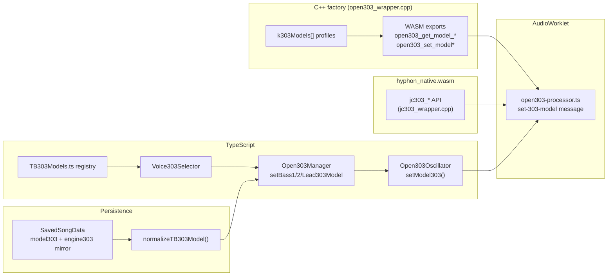

# 303 Voices — selectable TB-303 models

The dual-engine switch (`open303` / `jc303`) has grown into a **selectable,
extensible list of TB-303 "voices"** (models). Each of the three 303 tracks —
**SYNTH A (lead303)**, **SYNTH B (bass1)** and **BASS 2 (bass2)** — picks its
voice independently, so you can A/B stock vs. experimental characters per
track without touching the others.

## Concepts

| Term | Meaning |
|------|---------|
| **Engine family** | One of the two DSP implementations compiled into `hyphon_native.wasm`: `open303` (custom synth, `emscripten/open303_wrapper.cpp`) or `jc303` (authentic `rosic::Open303`, `emscripten/jc303_wrapper.cpp`). |
| **Voice / model** | A named sound character with a stable string id (e.g. `stock-open303`, `experimental-01`). Voices in the `open303` family are *coefficient profiles* applied to the shared DSP topology; `jc303`-family voices run on the rosic engine. |

## Current catalog

Canonical registry: `src/engines/TB303Models.ts` (`TB303_MODELS`) mirrored by
`k303Models[]` in `emscripten/open303_wrapper.cpp`. Ids are persisted in saved
songs — **never rename** a shipped id.

| Id | Label | Base engine | Character | Inspired by |
|----|-------|-------------|-----------|-------------|
| `stock-open303` | Stock Open303 | `open303` | Pristine default — bit-identical to the pre-voices custom engine | Hyphon built-in Open303 |
| `jc303` | Authentic JC303 | `jc303` | Authentic rosic::Open303 DSP — same as the legacy "Authentic JC303" engine | TB-303 (rosic::Open303) |
| `1ink303-v1` | 1ink303 v1 | `open303` | Warmer filter base, rounder accent, slower slides, gentle saw shaping | In-house Hyphon voice |
| `experimental-01` | Experimental 01 | `open303` | Hot resonance feedback, snappier envelope, harder accent punch, heavier square drive | Scratchpad / dev voice |
| `rebirth-338-1.5` | ReBirth RB-338 1.5 | `open303` | Squishier, self-oscillation-prone filter, gooey slides, big accent lift | ReBirth RB-338 1.5 *(not a clone)* |
| `rebirth-2.0` | ReBirth 2.0 | `open303` | Cleaner/tighter filter than 1.5, punchier accent, snappier envelope | ReBirth RB-338 2.0 *(not a clone)* |
| `mb33-mkii` | MB33 mkII | `open303` | Boxier digital filter, distinct accent punch, square/saw grit | MAM MB33 mkII *(not a clone)* |
| `raveolution` | Raveolution 309 | `open303` | Bright harsh self-osc, aggressive resonance, snappy envelope, heavy drive | Quasimidi Raveolution 309 *(not a clone)* |

Catalogued-but-unshipped voices are hidden from the UI and normalize to the
stock voice of their family when loaded from a song.

### ReBirth character voices (`rebirth-338-1.5`, `rebirth-2.0`)

These are **inspired-by profiles, not bit-perfect or legal clones** of
Propellerhead ReBirth RB-338 — the UI tooltips and this catalog say so. They
ship no ReBirth samples or assets; they are coefficient profiles on the stock
open303 DSP tuned toward the *character* of two RB-338 eras.

Coefficient deltas vs `stock-open303` (see `k303Models[]` in
`emscripten/open303_wrapper.cpp`):

| Knob | stock | `rebirth-338-1.5` | `rebirth-2.0` |
|------|-------|-------------------|---------------|
| cutoff base Hz | 20 | 22 (darker) | 20 |
| cutoff range × | 400 | 380 | 410 (brighter top) |
| resonance feedback | 3.9 | 4.10 (squishy, near self-osc) | 3.95 (cleaner) |
| accent filter boost | 0.40 | 0.50 | 0.60 (punchier) |
| accent VCA boost | 0.30 | 0.32 | 0.42 (harder hit) |
| decay min / range s | 0.05 / 1.95 | 0.04 / 1.60 | 0.035 / 1.40 (snappier) |
| slide min / range s | 0.01 / 0.49 | 0.02 / 0.60 (gooey) | 0.012 / 0.50 |
| square drive × | 3.0 | 3.0 | 3.4 |
| saw drive | 0.0 | 0.20 (mild grit) | 0.12 |

Character summary: **1.5** leans into a squishier, more resonant/self-
oscillating filter with longer slides and a big accent lift; **2.0** is
tighter and cleaner with a harder, punchier accent and snappier envelope.

Full ReBirth *song* fidelity is out of scope here (owned by epic #876); these
voices target instrument character only, validated by A/B render (below), not
by matching real RB-338 recordings.

### P2 character voices (`mb33-mkii`, `raveolution`)

These are **inspired-by profiles, not bit-perfect or legal clones** of the
referenced hardware/software emulations — the UI tooltips and this catalog say
so. They ship no third-party samples or assets; they are coefficient profiles
on the stock open303 DSP tuned toward each target's *character*.

Coefficient deltas vs `stock-open303`:

| Knob | stock | `mb33-mkii` | `raveolution` |
|------|-------|-------------|---------------|
| cutoff base Hz | 20 | 24 (boxier mid) | 18 (brighter low) |
| cutoff range × | 400 | 360 (narrower sweep) | 440 (brighter top) |
| resonance feedback | 3.9 | 3.85 (distinct curve) | 4.25 (aggressive self-osc) |
| accent filter boost | 0.40 | 0.52 (distinct punch) | 0.58 (hard filter hit) |
| accent VCA boost | 0.30 | 0.38 | 0.48 (aggressive envelope) |
| decay min / range s | 0.05 / 1.95 | 0.045 / 1.70 | 0.028 / 1.15 (snappy) |
| slide min / range s | 0.01 / 0.49 | 0.014 / 0.45 | 0.006 / 0.35 (fast) |
| square drive × | 3.0 | 3.8 (digital grit) | 4.2 (heavy drive) |
| saw drive | 0.0 | 0.25 (digital grit) | 0.08 |

Character summary: **MB33 mkII** leans into a boxier, more "digital" filter
feel with a distinct accent punch and waveshaping grit; **Raveolution** is
brighter and harsher with aggressive resonance/self-oscillation, a snappy
envelope, and heavier drive for dance-floor character.

## Architecture

End-to-end flow from the C++ factory through the UI:



See also [jc303-prophecy.md](jc303-prophecy.md) for the legacy dual-engine
switch and Prophecy formant routing, and
[303-authenticity-gaps.md](303-authenticity-gaps.md) for the Phase-0
authenticity audit / baseline WAVs that drive the high-fidelity epic (#972).

### Per-instance routing

Each 303 track picks its voice independently. Three `Open303Oscillator`
instances share one `open303-processor` worklet but hold separate model state:

| UI part | Track key | Manager method | Oscillator instance |
|---------|-----------|----------------|---------------------|
| SYNTH A (303 waves) | `partA` | `setLead303Model` | `lead303` |
| SYNTH B (303 waves) | `partB` | `setBass1Model` | `bass1` |
| BASS 2 | `bass2` | `setBass2Model` | `bass2` |

After audio init or song load, `useAppState` calls
`Open303Manager.syncModel303Settings({ lead, bass1, bass2 })` with ids from
`normalizeTB303Model(model303, engine303)` per part.

### C++ (`emscripten/open303_wrapper.cpp`)

The registry is a static table of `Open303ModelProfile` rows (`k303Models[]`)
holding the id, label, engine family, and the coefficient profile:

- filter cutoff curve (`cutoffBaseHz`, `cutoffRangeMul`) and resonance
  feedback gain (`resFeedback`, ≈4 approaches self-oscillation)
- accent filter/VCA boost depths
- envelope decay range, slide/portamento range
- square overdrive depth and optional saw waveshaping drive

WASM exports (also embind-bound where types allow):

```
open303_get_model_count()          → number of registry entries
open303_get_model_id(i)            → const char* stable id
open303_get_model_label(i)         → const char* label
open303_get_model_engine(i)        → 0 = open303 family, 1 = jc303 family
open303_set_model(handle, i)       → apply profile to an instance (1 = ok)
open303_get_model(handle)          → currently applied model index
open303_find_model_index(id)       → registry index for a stable id, or -1
open303_set_model_by_id(handle,id) → apply profile by stable string id (1 = ok)
getAvailable303Models()            → JSON list (embind, main-thread module)
```

`open303_set_model_by_id` is the future-proof string setter (the issue's
`set303Model(instanceId, modelName)`). Unknown ids and jc303-family models
return 0; it is exactly equivalent to resolving the id with
`open303_find_model_index` and calling `open303_set_model`. The AudioWorklet
uses the index-based path (it already holds the index from the registry map it
builds at init and needs the engine family to route jc303 vs open303).

`stock-open303` is row 0 and its coefficients are exactly the constants the
engine used before the registry existed, so the default sound is unchanged.
The `sawDrive = 0` fast path skips the waveshaper entirely — stock saw output
is bit-identical.

### TypeScript

`src/engines/TB303Models.ts` mirrors the C++ table (`TB303_MODELS`) and is the
single source the UI and persistence layers read:

- `TB303ModelId` — union of all voice ids (persisted in songs; never rename).
- `getAvailableTB303Models()` — what the UI selector lists.
- `normalizeTB303Model(model303?, engine303?)` — resolves any persisted
  model/engine pair (including legacy songs and unknown future ids) to a
  valid, available model.
- `tb303ModelFamily(id)` / `stockModelForFamily(family)` — family helpers.

Plumbing:

- `Open303Oscillator.setModel303(model)` posts `set-303-model`
  (`{ model, engine }`) to the worklet; the legacy `setEngine303()` still
  works and maps to the family's stock voice.
- `Open303Manager.setBass1Model / setBass2Model / setLead303Model` and
  `syncModel303Settings({ lead, bass1, bass2 })` (applied after audio init /
  song load in `useAppState`).
- The worklet (`open303-processor.ts`) discovers the native registry at init
  by reading the `open303_get_model_*` exports. On a `set-303-model` message
  it switches the engine family (clearing held notes) and applies the
  coefficient profile via `open303_set_model`.

### Graceful degradation

Every step feature-detects:

- **Old WASM, new TS** — if `hyphon_native.wasm` predates the registry, the
  worklet falls back to the `engine` hint included in the `set-303-model`
  message, so both stock voices keep working; non-stock voices simply sound
  stock until the WASM is rebuilt (`pnpm run build:emcc`).
- **New WASM, old song** — `normalizeTB303Model` maps `engine303:'jc303'` →
  `jc303` and everything else → `stock-open303`.
- **Old build, new song** — the UI mirrors each `model303` change into the
  legacy `engine303` field on save, so older builds load the closest stock
  voice.

### UI

`src/components/Voice303Selector.tsx` renders the "303 Voice" list on the
SYNTH A / SYNTH B / BASS 2 rack panels (`useHardwarePanels.tsx`). It is
populated from `getAvailableTB303Models()` with the model description as the
tooltip — new registry entries appear automatically. The old two-way
`Engine303Selector` is deprecated but kept for compatibility.

## Legacy `engine303` → `model303` migration

Songs saved before the voices architecture carry only `engine303: 'open303' |
'jc303'`. New songs write **both** fields so older builds still load the
closest stock voice.

| Saved field(s) | Resolved `model303` | Notes |
|----------------|---------------------|-------|
| `model303: 'experimental-01'` | `experimental-01` | Primary field wins |
| `model303` + conflicting `engine303` | `model303` (if known + available) | `model303` takes precedence |
| `engine303: 'jc303'` only | `jc303` | Legacy JC path |
| `engine303: 'open303'` only | `stock-open303` | **`open303` aliases to `stock-open303`** |
| Unknown future id | `stock-open303` or `jc303` | Falls back via `engine303` hint |

API aliases:

- `setEngine303('open303')` → `stock-open303` (via `stockModelForFamily`)
- `setEngine303('jc303')` → `jc303`
- On save, `useHardwarePanels` mirrors each `model303` change into `engine303`
  via `tb303ModelFamily(model)`.

## Adding a new voice

Checklist — this is the **only** guide needed to ship voice #N:

1. **C++ coefficient row** — add a profile to `k303Models[]` in
   `emscripten/open303_wrapper.cpp` (open303-family voices are coefficient
   profiles; jc303-family voices route to `jc303_wrapper.cpp` instead).
2. **Registry entry** — add a matching row to `TB303_MODELS` in
   `src/engines/TB303Models.ts` with `available: true`, `label`,
   `shortLabel`, and `description` (tooltip text).
3. **Rebuild emcc** — `pnpm run build:emcc` (or `bash emscripten/build.sh`).
4. **UI description** — the `description` field in step 2 is the tooltip shown by
   `Voice303Selector`; no component changes required.
5. **Test pattern A/B** — run the offline voice test and manual in-app check:
   - Automated: `bash emscripten/tests/run_offline_voices_test.sh`
   - Manual: program a 303 bassline, toggle stock → new voice → stock (see
     [Manual A/B checklist](#manual-ab-checklist-in-app-after-pnpm-run-buildemcc)
     below).

No other call-site changes — the selector, worklet routing, persistence, and
normalization all read the registry.

## Out of scope for v1

- Per-pattern model automation
- Model-specific default knob positions
- Live A/B compare mode (two synced instances)
- Export/import of model tweaks as JSON

## Tests

- `src/__tests__/TB303Models.test.ts` — registry integrity, normalization,
  legacy-song compatibility, oscillator/manager model plumbing.
- `src/components/__tests__/Voice303Selector.test.tsx` — dynamic UI list,
  selection callbacks, tooltips, a11y.
- `src/__tests__/Open303EngineSelect.test.ts` /
  `engine303-roundtrip.test.ts` — legacy engine switch behaviour still intact.
- `tests/engine303-switch.spec.ts` — Playwright E2E: per-part voice selection,
  registry-driven tooltip coverage (skipped with the rest of the E2E suite).
- `emscripten/tests/tb303_factory_smoke_test.cpp` — factory/registry surface:
  `getAvailable303Models()` JSON, per-model create/process/finite/non-silent,
  index vs string-id equivalence, unknown-id and jc303 rejection, mid-session
  switching (below).
- `emscripten/tests/tb303_voices_offline_test.cpp` — offline DSP buffer test
  (below).

### Offline voice verification (no emsdk required)

`emscripten/tests/tb303_voices_offline_test.cpp` renders a **fixed pattern**
through the open303-family DSP via the plain C API and proves the new voices
are audibly distinct while the stock path is untouched. It compiles with a host
`g++` using the stubs in `emscripten/tests/emscripten_stub/`:

```bash
bash emscripten/tests/run_offline_voices_test.sh
```

**Fixed test pattern** (the documented A/B reference):

| Setting | Value |
|---------|-------|
| Sample rate / block | 44100 Hz / 128 frames |
| Waveform | saw |
| cutoff / resonance / envMod | 0.35 / 0.70 / 0.55 |
| decay / accent / volume | 0.50 / 0.70 / 0.80 |
| Steps | 4 × 0.15 s, notes C2 C2 E♭2 G2 (MIDI 36 36 39 43) |
| Accent | steps 2 & 4 (velocity 120 vs 90) |
| Slide | steps 2 & 4 legato (note-on without note-off) |

What it asserts:

1. `experimental-01`, `1ink303-v1`, `rebirth-338-1.5`, `rebirth-2.0`,
   `mb33-mkii` and `raveolution` are registered as open303-family models.
2. The stock render is **deterministic** (bit-identical across two runs).
3. **Stock unchanged**: stock → other voice → stock reproduces the exact stock
   buffer (a mid-session switch does not corrupt the stock path).
4. **Audible difference**: each shipped voice differs from stock by relative
   RMS > 2 % and peak sample delta > 1e-3 (all currently render ~1.0 relative
   RMS), the two ReBirth eras are audibly distinct from each other, and the
   MB33 mkII and Raveolution profiles are audibly distinct from each other.
5. `open303_set_model()` rejects the jc303-family model and unknown indices.
6. Switching the model every block mid-render stays finite — no crash, no NaN.

This same fixed pattern is the **shared A/B regression pattern** for both the
first custom voices (#898), the ReBirth character voices (#900), and the P2
character voices (#902). Phase-0 (#973) also dumps the same musical content at
48 kHz / 24-bit for open303-family voices **and** the `jc303` soft oracle via
`bash scripts/generate_303_baselines.sh` — see
[303-authenticity-gaps.md](303-authenticity-gaps.md) and
[303-baseline/](303-baseline/).

### Manual A/B checklist (in-app, after `pnpm run build:emcc`)

Once the WASM is rebuilt so the coefficient profiles are live:

- [ ] Program a simple 303 bassline on BASS 2 (or SYNTH B), moderate cutoff +
      resonance, a couple of accented steps.
- [ ] Toggle **303 Voice**: stock-open303 → experimental-01 → 1ink303-v1 while
      it plays. Each switch should be click-free (held notes released) and
      audibly change filter/accent character.
- [ ] Return to stock-open303 — it should sound exactly as before the switch.
- [ ] Repeat on a second part with a different voice to confirm independent
      per-part selection.
