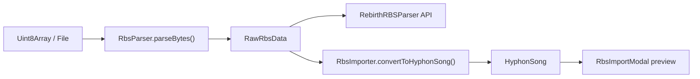

# RBS Import Pipeline

Hyphon imports ReBirth RB-338 `.rbs` song files through a staged pipeline: raw bytes → binary parser → typed intermediate model → Hyphon song → UI preview.

## Pipeline overview



| Stage | Module | Responsibility |
|-------|--------|----------------|
| Bytes | `File.arrayBuffer()` / test fixtures | COOP/COEP unrelated; parser uses `DataView` only |
| Binary shim | `RbsParser` | IFF CAT RB40 detection, legacy fixed-offset extraction, error classification |
| Public parser API | `RebirthRBSParser` | Version-aware spec methods: `parseHeader()`, `parsePatterns()`, … |
| Types | `parser-types.ts`, `types.ts` | `RbsParserError`, `RawRbsData`, `Tb303Step`, automation lanes |
| Conversion | `RbsImporter` | 16→32 expansion, PCF→automation, drum kit mapping, song arrangement |
| Hyphon model | `src/types.ts` | `Note`, `Pattern`, `SynthParams` (not modified by importer) |
| Modal glue | `src/utils/rbsImportUtils.ts` | Progress stages, error categorization, display helpers |

## Parser split: `RebirthRBSParser` vs `RbsParser`

**`RbsParser`** (`src/importers/rbs/RbsParser.ts`) is the **byte-extraction shim**:

- Owns `DataView` reads, IFF chunk walking, legacy offsets (`OFFSETS` in `parser-types.ts`).
- Entry points: `parseRbsFile(file)`, `parseBytes(bytes, options)`.
- Returns `RbsParserResult` = `{ success, data?: RawRbsData, error?: RbsParserError }`.
- Never throws; failures are classified errors.

**`RebirthRBSParser`** (`src/importers/rbs/RebirthRBSParser.ts`) is the **canonical public API**:

- Delegates binary work to `RbsParser`.
- Exposes spec-shaped methods after a successful parse: `parseHeader()`, `parsePatterns()`, `parseSynthParameters()`, `parseSongArrangement()`, `parseAutomation()`.
- `parseFile(file)` / `parseBuffer(bytes)` return `RebirthParseResult` with human-readable `error` strings for the modal.

Rule of thumb: **tests and importers should parse via `RbsParser.parseBytes` or `RebirthRBSParser.parseBuffer`; UI uses `parseFile`.**

## Binary format (two paths)

### 1. IFF CAT RB40 (v2.0+ song files)

```
CAT <be32 size> RB40
  HEAD  …   version / copyright
  GLOB  …   tempo (BPM×10 LE), shuffle, loop points, play mode
  CAT DEVL  …   TB-303 / TR-808 / TR-909 pattern banks
  CAT TRKL  …   TRAK event lists (delta ticks + controller + value)
```

- Chunk IDs: 4-byte ASCII, sizes **big-endian**.
- Odd-length payloads: one pad byte before the next chunk.
- Unknown chunk IDs are skipped by `length (+ pad)` without aborting the walk.

### 2. Legacy fixed-offset (single-pattern)

Linear layout from offset `0x00`: `RB338` header → TB-303 A/B → drums → PCF → automation (`OFFSETS` in `parser-types.ts`). Used when IFF song data is incomplete or absent.

## Classified error codes

`RbsParserError` is a discriminated union; `classifyParserError()` maps to stable `RBS_ERROR_*` codes for tests and `rbsImportUtils.categorizeError()`.

| Code | Typical cause |
|------|----------------|
| `RBS_ERROR_INVALID_EXTENSION` | Filename not ending in `.rbs` when extension check enabled |
| `RBS_ERROR_FILE_TOO_SMALL` | Fewer than `MIN_FILE_SIZE` (768) bytes |
| `RBS_ERROR_FILE_TOO_LARGE` | Over 10 MB |
| `RBS_ERROR_UNKNOWN_FORMAT` | Bad magic, wrong container |
| `RBS_ERROR_TRUNCATED_CHUNK` | Chunk length extends past EOF |
| `RBS_ERROR_UNSUPPORTED_VERSION` | Version string not in `SUPPORTED_VERSIONS` |
| `RBS_ERROR_CORRUPTED_DATA` | Section parse failure (header, IFF, etc.) |
| `RBS_ERROR_READ_ERROR` | Unexpected exception (should not throw to caller) |

## Importer mapping highlights

- **TB-303 steps** → `Note` on `partA` / `partB` / `bass2` (per `RbsImportOptions`).
- **16→32 expansion**: each ReBirth 16th becomes two Hyphon 32nds; **ties extend `Note.length` without placing a second trigger** on tied sub-steps.
- **Slides** → `Note.slide` + `length: 2`; **accents** → higher velocity on the first sub-step + optional automation lane.
- **PCF** (0–127 per step) → filter-cutoff automation lanes (`convertPcfToAutomation`) or `pcfFilter` when `importPcfAsFilter`.
- **808 / 909** → `params.drumKit` and kit-specific kick/snare/hat tone ranges consumed by `DrumKitEngine`.
- **Automation lanes** use `target` + `parameter` strings that must match `SynthParams` keys (synth targets) or master-bus names understood by `AutomationScheduler`.

## Testing strategy

All fixtures are **synthesized in memory** (`src/__tests__/rbs/fixtures.ts`) — no real `.rbs` files in the repo.

- **Property tests** (`RbsParser.property.test.ts`): `@fast-check/vitest` — `parseBytes` never throws; valid generators round-trip tempo, kit, GLOB fields.
- **Edge tests** (`RbsParser.edge.test.ts`): truncation, padding, unknown chunks, bad magic.
- **Fidelity tests** (`RbsImporter.fidelity.test.ts`): ties, slides, accents, PCF curve, drums, empty patterns.
- **Boundary tests** (`RbsImporter.boundaries.test.ts`): `SynthParams` key validity, `Note` shape, drum tuning ranges.
- **Snapshot** (`RbsImporter.snapshot.test.ts`): narrow mapped summary only, with independent invariants asserted first.

## Related files

- `src/importers/rbs/index.ts` — public exports
- `src/components/RbsImportModal.tsx` — user-facing import UI
- `src/audio/automation/AutomationScheduler.ts` — playback of imported automation (read-only for this pipeline)
