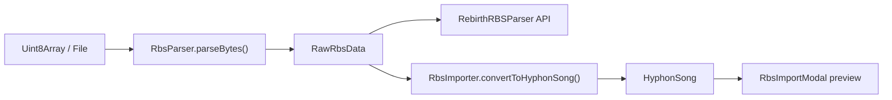

# RBS Import Pipeline

Hyphon imports ReBirth RB-338 `.rbs` song files through a staged pipeline: raw bytes → binary parser → typed intermediate model → Hyphon song → UI preview.

## Pipeline overview



| Stage | Module | Responsibility |
|-------|--------|----------------|
| Bytes | `File.arrayBuffer()` / test fixtures | COOP/COEP unrelated; parser uses `DataView` only |
| Binary shim | `RbsParser` | IFF CAT RB40 detection, legacy fixed-offset extraction, error classification |
| Public parser API | `RebirthRBSParser` | Version-aware spec methods: `parseHeader()`, `parsePatterns()`, … |
| Types | `parser-types.ts`, `types.ts` | `RbsParserError`, `RawRbsData`, `Tb303Step`, automation lanes |
| Conversion | `RbsImporter` | 16→32 expansion, PCF→automation, drum kit mapping, song arrangement |
| Hyphon model | `src/types.ts` | `Note`, `Pattern`, `SynthParams` (not modified by importer) |
| Modal glue | `src/utils/rbsImportUtils.ts` | Progress stages, error categorization, display helpers |

## Parser split: `RebirthRBSParser` vs `RbsParser`

**`RbsParser`** (`src/importers/rbs/RbsParser.ts`) is the **byte-extraction shim**:

- Owns `DataView` reads, IFF chunk walking, legacy offsets (`OFFSETS` in `parser-types.ts`).
- Entry points: `parseRbsFile(file)`, `parseBytes(bytes, options)`.
- Returns `RbsParserResult` = `{ success, data?: RawRbsData, error?: RbsParserError }`.
- Never throws; failures are classified errors.

**`RebirthRBSParser`** (`src/importers/rbs/RebirthRBSParser.ts`) is the **canonical public API**:

- Delegates binary work to `RbsParser`.
- Exposes spec-shaped methods after a successful parse: `parseHeader()`, `parsePatterns()`, `parseSynthParameters()`, `parseSongArrangement()`, `parseAutomation()`.
- `parseFile(file)` / `parseBuffer(bytes)` return `RebirthParseResult` with human-readable `error` strings for the modal.

Rule of thumb: **tests and importers should parse via `RbsParser.parseBytes` or `RebirthRBSParser.parseBuffer`; UI uses `parseFile`.**

## Binary format (two paths)

### 1. IFF CAT RB40 (v2.0+ song files)

```
CAT <be32 size> RB40
  HEAD  …   version / copyright
  GLOB  …   tempo (BPM×1000 BE), shuffle, loop points, play mode
  CAT DEVL  …   TB-303 / TR-808 / TR-909 pattern banks
  CAT TRKL  …   TRAK event lists (delta ticks + controller + value)
```

- Chunk IDs: 4-byte ASCII, sizes **big-endian**.
- Odd-length payloads: one pad byte before the next chunk.
- Unknown chunk IDs are skipped by `length (+ pad)` without aborting the walk.

### 2. Legacy fixed-offset (single-pattern)

Linear layout from offset `0x00`: `RB338` header → TB-303 A/B → drums → PCF → automation (`OFFSETS` in `parser-types.ts`). Used when IFF song data is incomplete or absent.

## Classified error codes

`RbsParserError` is a discriminated union; `classifyParserError()` maps to stable `RBS_ERROR_*` codes for tests and `rbsImportUtils.categorizeError()`.

| Code | Typical cause |
|------|----------------|
| `RBS_ERROR_INVALID_EXTENSION` | Filename not ending in `.rbs` when extension check enabled |
| `RBS_ERROR_FILE_TOO_SMALL` | Fewer than `MIN_FILE_SIZE` (768) bytes |
| `RBS_ERROR_FILE_TOO_LARGE` | Over 10 MB |
| `RBS_ERROR_UNKNOWN_FORMAT` | Bad magic, wrong container |
| `RBS_ERROR_TRUNCATED_CHUNK` | Chunk length extends past EOF |
| `RBS_ERROR_UNSUPPORTED_VERSION` | Version string not in `SUPPORTED_VERSIONS` |
| `RBS_ERROR_CORRUPTED_DATA` | Section parse failure (header, IFF, etc.) |
| `RBS_ERROR_READ_ERROR` | Unexpected exception (should not throw to caller) |

## Importer mapping highlights

- **TB-303 steps** → `Note` on `partA` / `partB` / `bass2` (per `RbsImportOptions`).
- **16→32 expansion**: each ReBirth 16th becomes two Hyphon 32nds; **ties extend `Note.length` without placing a second trigger** on tied sub-steps.
- **Slides** → `Note.slide` + `length: 2`; **accents** → higher velocity on the first sub-step + optional automation lane.
- **PCF** (0–127 per step) → filter-cutoff automation lanes (`convertPcfToAutomation`) or `pcfFilter` when `importPcfAsFilter`.
- **808 / 909** → `params.drumKit` and kit-specific kick/snare/hat tone ranges consumed by `DrumKitEngine`.
- **Automation lanes** use `target` + `parameter` strings that must match `SynthParams` keys (synth targets) or master-bus names understood by `AutomationScheduler`.
- **TRAK events** use **per-track controller IDs** (`trakControllers.ts`, rbs.h). Pattern select on TB-303 #1 is ctrl `0x01` (not the legacy automation enum `0x02`). `AutomationScheduler.scheduleFromTrakEvents` maps `(trackIndex, ctrlId)` pairs; pattern-select events feed `songStructure` only.
- **Song arrangement** (`RbsImporter.buildSongArrangement`): maps up to **32 pattern slots** per track (ReBirth DEVL limit) into `trackStorage` + `songStructure`. Legacy saved songs with 8 slots migrate on load (`SavedSongData` version 2).

## Testing strategy

### Synthetic (always-on, CI)

In-memory builders in `src/__tests__/rbs/fixtures.ts` — no binary files required.

- **Property tests** (`RbsParser.property.test.ts`): `@fast-check/vitest` — `parseBytes` never throws; valid generators round-trip tempo, kit, GLOB fields.
- **Edge tests** (`RbsParser.edge.test.ts`): truncation, padding, unknown chunks, bad magic.
- **DEVL struct tests** (`RbsDevlParser.test.ts`): RBS42-aligned `303 ` / `808 ` chunk round-trip.
- **Fidelity tests** (`RbsImporter.fidelity.test.ts`): ties, slides, accents, PCF curve, drums, empty patterns.
- **Boundary tests** (`RbsImporter.boundaries.test.ts`): `SynthParams` key validity, `Note` shape, drum tuning ranges.
- **Snapshot** (`RbsImporter.snapshot.test.ts`): narrow mapped summary only, with independent invariants asserted first.

### Generated corpus (CI when `test-fixtures/rbs/generated/` is present)

License-clear struct-accurate IFF files committed to the repo. Regenerate with `bash scripts/generate-rbs-corpus.sh`.

- **Corpus tests** (`RbsCorpus.test.ts` → `generated` suite): parse + import invariants + golden JSON per file (`__snapshots__/rbs-corpus/`).
- Files: `generated_v20_song_arrangement.rbs`, `generated_v20_pattern_mode.rbs`, `generated_v15_single_303.rbs`, etc.

### External reference corpus (opt-in)

Downloaded ReBirth songs are **not committed** (copyright). Use for fidelity validation on developer machines or nightly CI:

```bash
bash scripts/fetch-rbs-corpus.sh
RBS_FIXTURE_DIR=test-fixtures/rbs/corpus pnpm exec vitest run src/__tests__/RbsCorpus.test.ts
```

Manifest and invariants: `src/__tests__/rbs/corpusUtils.ts`. Provenance: `test-fixtures/rbs/README.md`.

### Negative fixture

`test-fixtures/10_isotherms.mid` is Standard MIDI (`MThd`), not ReBirth. Parser tests assert `.rbs` import **fails loudly** — no mock fallback (`RbsParser.test.ts`, `RbsCorpus.test.ts`).

## Export (pattern + song mode)

`RbsExporter` (`src/importers/rbs/RbsExporter.ts`) writes IFF `CAT RB40` files from the current Hyphon project:

| Chunk | Content |
|-------|---------|
| `HEAD` | `ReBirth RB-338 v2.0` (or v1.5 subset) |
| `GLOB` | Pattern mode (`playMode = 0`) or song mode (`playMode = 1`), tempo × 1000 BE, shuffle, loop bars |
| `CAT DEVL` | `303 ` A/B banks (up to 32 slots), `808 `/`909 ` drums, `PCF `, `MIXR`, FX stubs |
| `CAT TRKL` | Nine `TRAK` tracks. Song mode writes pattern-select (and param events from preserved TRAK / `trakParamEvents` / automation lanes). Pattern mode writes empty TRAK lists. |

**UI:** Bottom bar **Export .rbs** (next to Import .rbs). `hyphonSongFromSavedData` now copies `trackStorage` / `songStructure` / automation / PCF / loop bars. Export uses `mode: 'song'` when Song Mode is active **or** the arrangement references a slot greater than 0.

**Limitations (warnings emitted):**
- Sampler, Prophecy, and non–TB-303 waveforms are not exported
- Hyphon 32-step patterns collapse to ReBirth 16-step (`collapse32Steps: true` default)
- Pattern banks above 32 slots are truncated (Hyphon `MAX_TRACK_PATTERN_SLOTS`)
- Tempo automation stays in Hyphon lanes (IFF tempo is GLOB only)
- Manual QA: open exported `.rbs` in original ReBirth RB-338 to verify device compatibility

**Round-trip:** `src/__tests__/RbsExporter.test.ts` — export → `RbsParser.parseBytes` for pattern mode, song-mode TRAK, v1.5 single-303, 9+ slot banks, and `SavedSongData` reconstruction.

GitHub **#1139** landed as **#1154**; remaining leftovers (UI song export, 32-slot DEVL, PCF/`trackParamStorage` apply) are this slice. Close or retitle #1139 after merge so the weekly-plan owner action is done.

## Playwright E2E (CI)

Committed fixture: `tests/fixtures/rbs/e2e_song_arrangement.rbs` (synthetic v2.0 song arrangement, license-clear).

| Spec | Coverage |
|------|----------|
| `tests/rbs-automation.spec.ts` | Import modal → Import Report → song mode playback → playhead / automation scheduler |
| `tests/helpers/rbs-e2e.ts` | Shared init (`?e2e=1`), fixture path, `window.__HYPHON_E2E__` lane/step getters |

CI runs via `.github/workflows/playwright-e2e.yml` against `pnpm run build` + `pnpm run preview` (COOP/COEP headers for threaded Open303 WASM).

**Regenerate fixture** (optional): `GENERATE_RBS_CORPUS=1 pnpm exec vitest run src/__tests__/rbs/generateCorpusFiles.test.ts`, then copy `test-fixtures/rbs/generated/generated_v20_song_arrangement.rbs` → `tests/fixtures/rbs/e2e_song_arrangement.rbs`.

### Manual QA checklist (real v2.0 `.rbs` — not in CI)

Use original ReBirth RB-338 exports under appropriate license. Do **not** commit proprietary files.

1. **Import** — Bottom bar **Import .rbs** → select file → **Import Song** → verify Import Report (steps, automation lane count, song-mode badge).
2. **Song mode** — **Toggle Song Mode** → arrangement matches source (pattern indices, bar count); enable **Loop Song**.
3. **Playback** — **Start Playback** → playhead advances through arrangement measures; pattern steps trigger on expected tracks.
4. **Automation** — During playback, SYNTH A/B **CUTOFF** / **RESONANCE** knobs move when source had TRAK/PCF automation; cyan automation ring on driven params.
5. **303 engines** — Toggle `engine303` (`open303` / `jc303`) per voice; confirm filter/decay timbre matches file.
6. **Round-trip spot-check** — Export `.rbs` from Hyphon (song mode if the arranger is active), re-import, compare step grid, arrangement slots, and knob snapshot.

## Related files

- `src/importers/rbs/index.ts` — public exports
- `src/components/RbsImportModal.tsx` — user-facing import UI
- `src/audio/automation/AutomationScheduler.ts` — playback of imported automation (read-only for this pipeline)
