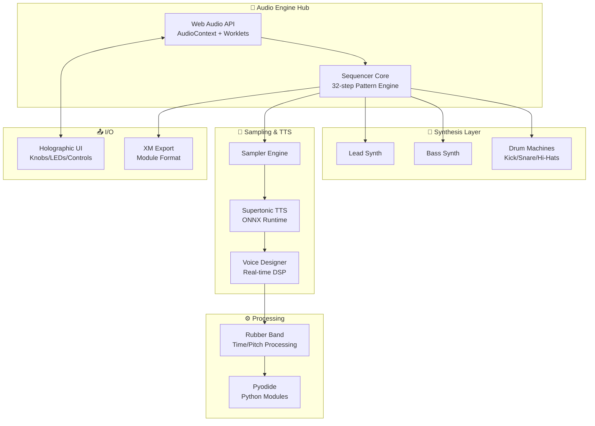

# Web Sequencer - Architectural & Integration Plan

> **Purpose**: This document serves as the "glue" that connects disparate features, clarifies the overall vision, and provides a roadmap for keeping components cohesive. It complements [README.md](./README.md) by focusing on architecture and integration rather than setup instructions.

---

## 1. Introduction

### Vision
Web Sequencer is a browser-based, 32-step music production environment that bridges the gap between hardware-style workflow and modern web capabilities. It combines real-time synthesis, voice-driven sampling, and classic drum machine patterns into a unified creative tool.

### The Cohesion Challenge
The project has evolved organically with many experimental features:
- **TTS Integration**: Supertonic voice synthesis via ONNX models
- **Holographic UI**: 3D knobs and hardware-style controls
- **Rubber Band DSP**: Time-stretching and pitch-shifting
- **Python in Browser**: Pyodide-powered audio processing

This plan addresses the risk of feature fragmentation by defining clear integration points and a unified architecture.

---

## 2. Core Architecture

### 2.1 Hub-and-Spoke Model



### 2.2 Component Responsibilities

| Component | Technology | Responsibility |
|-----------|------------|----------------|
| **Audio Hub** | Web Audio API | Master clock, routing, mixing, output |
| **Sequencer Core** | JavaScript/TypeScript | Pattern scheduling, song mode, 8-slot patterns |
| **Synth Engine** | Web Audio Nodes | Lead/Bass synthesis, drum generation |
| **Sampler** | AudioBuffer + TTS | Sample playback, Supertonic voice integration |
| **DSP Chain** | Rubber Band + Pyodide | Pitch/time manipulation, Python-based effects |
| **UI Layer** | WebGL/Canvas + DOM | Holographic knobs, step grid, visualization |

---

## 3. Feature Breakdown & Integration

### 3.1 Dual Synth Engine (Lead & Bass)
**Status**: Core feature  
**Integration Notes**:
- Both synths share a common voice architecture through the Audio Hub
- Pattern data stored in unified 8-slot pattern system (see [IMPLEMENTATION_SUMMARY.md](./IMPLEMENTATION_SUMMARY.md))
- Parameters controlled via Holographic Knobs system ([HOLOGRAPHIC_KNOBS.md](./HOLOGRAPHIC_KNOBS.md))

### 3.2 Drum Machines
**Status**: Core feature  
**Components**: Kick, Snare, Hi-Hats  
**Integration Notes**:
- Dedicated audio worklets for each drum voice
- Sequencer triggers via shared timing engine
- Exportable as separate tracks in XM format

### 3.3 Sampler with Supertonic TTS
**Status**: Advanced feature  
**Integration Points**:
- **Voice Generation**: Supertonic TTS runs in Web Worker with ONNX Runtime
- **Voice Editing**: [Supertonic-Voice-Mixer/](./Supertonic-Voice-Mixer/) provides PyQt5 desktop tool for voice preset design
- **Real-time DSP**: Voice Designer applies effects chain before sampler playback
- **Documentation**: See [TTS_IMPLEMENTATION_SUMMARY.md](./TTS_IMPLEMENTATION_SUMMARY.md), [TTS_DEPLOYMENT.md](./TTS_DEPLOYMENT.md)

### 3.4 Pattern Sequencer & Song Mode
**Status**: Core feature  
**Specifications**:
- 32 steps per pattern
- 8 pattern slots per track
- Song mode for pattern chaining
- Integration with all sound sources (synths, drums, sampler)

### 3.5 XM Module Export
**Status**: Export feature  
**Purpose**: Enable users to export compositions for use in trackers and DAWs  
**Integration**: Final mixdown from Audio Hub → XM encoder

---

## 4. Technology Stack & Interconnections

### 4.1 Stack Overview

```
┌─────────────────────────────────────────────────────────────┐
│                      PRESENTATION LAYER                      │
│  ┌──────────────┐  ┌──────────────┐  ┌──────────────────┐  │
│  │ Holographic  │  │   Pattern    │  │  Voice Designer  │  │
│  │    Knobs     │  │     Grid     │  │     (TTS)        │  │
│  └──────────────┘  └──────────────┘  └──────────────────┘  │
├─────────────────────────────────────────────────────────────┤
│                       LOGIC LAYER                            │
│  ┌──────────────┐  ┌──────────────┐  ┌──────────────────┐  │
│  │   Sequencer  │  │   Sampler    │  │    Pyodide       │  │
│  │    Engine    │  │   Controller │  │  (Python WASM)   │  │
│  └──────────────┘  └──────────────┘  └──────────────────┘  │
├─────────────────────────────────────────────────────────────┤
│                      AUDIO ENGINE                            │
│  ┌──────────────┐  ┌──────────────┐  ┌──────────────────┐  │
│  │  Web Audio   │  │  Supertonic  │  │   Rubber Band    │  │
│  │     API      │  │  TTS (ONNX)  │  │ (Time-stretch)   │  │
│  └──────────────┘  └──────────────┘  └──────────────────┘  │
└─────────────────────────────────────────────────────────────┘
```

### 4.2 Key Dependencies

| Technology | Version | Purpose | Integration Doc |
|------------|---------|---------|-----------------|
| Web Audio API | Native | Core audio engine | [BUILD_NOTES.md](./BUILD_NOTES.md) |
| Pyodide | Latest | Python in browser | [PERFORMANCE_MIGRATION_STRATEGY.md](./PERFORMANCE_MIGRATION_STRATEGY.md) |
| ONNX Runtime Web | Latest | TTS model inference | [TTS_DEPLOYMENT.md](./TTS_DEPLOYMENT.md) |
| Rubber Band | Compiled to WASM | Audio time-stretching | [RUBBERBAND_INTEGRATION_GUIDE.md](./RUBBERBAND_INTEGRATION_GUIDE.md) |
| Emscripten | Latest | C++ → WASM compilation | [BUILD_NOTES.md](./BUILD_NOTES.md) |

---

## 5. Integration Roadmap

### Phase 1: Foundation (Complete)
- [x] Web Audio API engine setup
- [x] Basic sequencer implementation
- [x] Lead/Bass synth voices
- [x] Drum machine framework

### Phase 2: Sampling & TTS (In Progress)
- [x] Supertonic TTS integration ([TTS_IMPLEMENTATION_SUMMARY.md](./TTS_IMPLEMENTATION_SUMMARY.md))
- [x] Voice Designer DSP chain ([SUSTAIN_PROCESSOR_RUBBERBAND_GUIDE.md](./SUSTAIN_PROCESSOR_RUBBERBAND_GUIDE.md))
- [ ] Unify TTS voice presets with main sequencer
- [ ] Optimize ONNX model loading ([TTS_PER_BANK_VERIFICATION.md](./TTS_PER_BANK_VERIFICATION.md))

### Phase 3: Advanced DSP (Active Development)
- [x] Rubber Band compilation to WASM ([RUBBERBAND_ANALYSIS.md](./RUBBERBAND_ANALYSIS.md))
- [x] Pyodide integration for Python effects
- [x] Complete Rubber Band + Sampler pipeline
- [x] Real-time parameter modulation
- [🚧] Vocal Workstation Features ([VOCAL_WORKSTATION_PLAN.md](./VOCAL_WORKSTATION_PLAN.md))
  - [x] Phase 1: Main Pitch Section + RubberBand Controls
  - [x] Phase 2: Per-Step Overrides + Visual Stretch
  - [x] Phase 3: Live Phoneme Painter
  - [ ] Phase 4: Instant Harmonizer Layers
  - [ ] Phase 5: Phoneme Elasticity per Step

### Phase 4: UI Polish & Performance
- [x] Holographic knobs implementation ([HOLOGRAPHIC_KNOBS.md](./HOLOGRAPHIC_KNOBS.md))
- [ ] Performance optimization ([PERFORMANCE_MIGRATION_STRATEGY.md](./PERFORMANCE_MIGRATION_STRATEGY.md))
- [ ] Mobile/touch responsiveness
- [ ] Final UI/UX cohesion pass

### Phase 5: Export & Release
- [ ] XM export finalization
- [ ] Documentation completion
- [ ] Deployment pipeline ([DEPLOYMENT_CONFIG.md](./DEPLOYMENT_CONFIG.md))

---

## 6. Development & Deployment

### 6.1 Build System
See [BUILD_NOTES.md](./BUILD_NOTES.md) for:
- Emscripten setup for WASM compilation
- Rubber Band library compilation steps
- Pyodide package bundling

### 6.2 Testing Strategy
- Unit tests for audio engine (`tests/` directory)
- TTS verification per voice bank ([TTS_PER_BANK_VERIFICATION.md](./TTS_PER_BANK_VERIFICATION.md))
- Integration tests for full signal chain

### 6.3 Deployment
Reference [DEPLOYMENT_CONFIG.md](./DEPLOYMENT_CONFIG.md) and [TTS_DEPLOYMENT.md](./TTS_DEPLOYMENT.md) for:
- Static hosting requirements
- ONNX model hosting (CDN vs. bundled)
- WASM asset optimization

---

## 7. Challenges & Solutions

### 7.1 Feature Cohesion
**Challenge**: Experimental features feel disconnected  
**Solution**: 
- Define clear audio graph routing (see Architecture diagram)
- Shared parameter system for all sound sources
- Unified pattern storage format

### 7.2 Performance
**Challenge**: Multiple heavy technologies (Pyodide, ONNX, Rubber Band)  
**Solution**:
- Web Workers for TTS inference
- Audio Worklets for real-time processing
- Lazy loading for non-critical components ([PERFORMANCE_MIGRATION_STRATEGY.md](./PERFORMANCE_MIGRATION_STRATEGY.md))

### 7.3 Documentation Fragmentation
**Challenge**: 30+ markdown files with overlapping content  
**Solution**:
- This plan.md as the central navigation document
- Cross-reference links between related docs
- Deprecate outdated summaries after consolidation

### 7.4 Python/WASM Bridge
**Challenge**: Pyodide integration complexity  
**Solution**:
- Clear C-interface definitions
- Async loading patterns
- Fallback to pure JS where possible

---

## 8. Future Vision

### 8.1 Short-term (3-6 months)
- Complete Rubber Band + Sampler integration
- XM export with full instrument support
- Performance optimization for 2-core systems

### 8.2 Medium-term (6-12 months)
- MIDI I/O support for hardware integration
- Collaborative jamming (WebRTC)
- Additional export formats (WAV, MIDI)

### 8.3 Long-term (12+ months)
- Plugin architecture for user-created effects
- AI-assisted pattern generation
- Mobile app wrapper (Capacitor/Tauri)

---

## 9. Contributing & Maintenance

### 9.1 Development Context
See [DEVELOPER_CONTEXT.md](./DEVELOPER_CONTEXT.md) for:
- Code style guidelines
- Architecture decisions
- Testing requirements

### 9.2 Adding New Features
1. Check this plan.md for integration points
2. Update relevant technical documentation
3. Add to Integration Roadmap (Phase appropriate)
4. Ensure cross-feature compatibility

### 9.3 Documentation Maintenance
- Keep [README.md](./README.md) for user-facing setup
- Update this plan.md when architecture changes
- Use [PR_SUMMARY.md](./PR_SUMMARY.md) template for changes
- Archive obsolete documents to `docs/archive/`

---

## 10. Quick Reference

| Topic | Document |
|-------|----------|
| Project Setup | [README.md](./README.md) |
| Build Instructions | [BUILD_NOTES.md](./BUILD_NOTES.md) |
| TTS Implementation | [TTS_IMPLEMENTATION_SUMMARY.md](./TTS_IMPLEMENTATION_SUMMARY.md) |
| Rubber Band Integration | [RUBBERBAND_INTEGRATION_GUIDE.md](./RUBBERBAND_INTEGRATION_GUIDE.md) |
| Holographic UI | [HOLOGRAPHIC_KNOBS.md](./HOLOGRAPHIC_KNOBS.md) |
| Performance | [PERFORMANCE_MIGRATION_STRATEGY.md](./PERFORMANCE_MIGRATION_STRATEGY.md) |
| Deployment | [DEPLOYMENT_CONFIG.md](./DEPLOYMENT_CONFIG.md) |
| Developer Guide | [DEVELOPER_CONTEXT.md](./DEVELOPER_CONTEXT.md) |
| Recent Changes | [PR_SUMMARY.md](./PR_SUMMARY.md) |

---

*Last Updated: 2026-02-12*  
*Maintainers: ford442*  
*Status: Living Document - Update with each major release*
